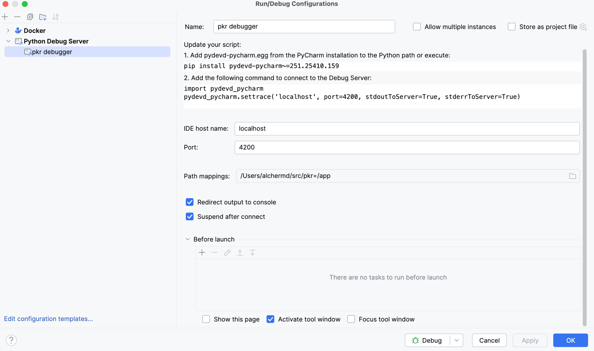

# pkr

## Debugger Setup

Currently, Pycharm debugging is supported. Create a new Python Debug configuration with the following settings:

Next, run `make up`. This should start the containers and attach it to the debugger.
